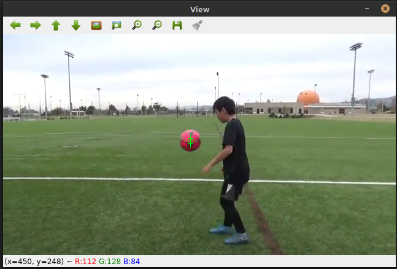
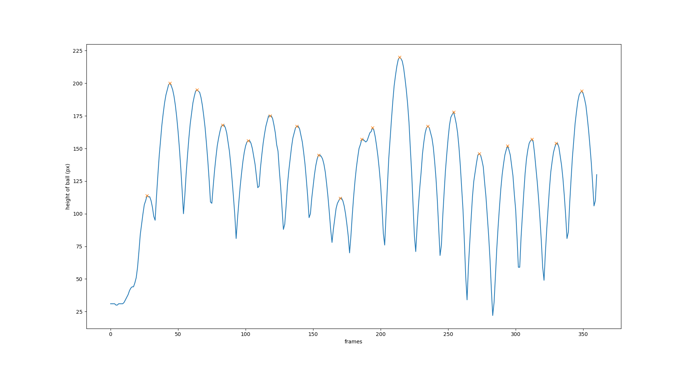

# juggle-counter
My brother is getting very good at juggling a soccer ball and he records himself to count how many he has done later. This program will count how many juggles he does for him.
I tried at first tracking the ball only based on shape, but the program would detect multiple erraneous circles and mess up the juggle count.
Then I tried using color HSV and it gave me better results.

First I graphed the y coordinates of the center of the detected ball with the x-axis being the number of frames.

Each marked X is a peak, when the ball is up and just about to fall down. The number of preaks should be the number of juggles done.

